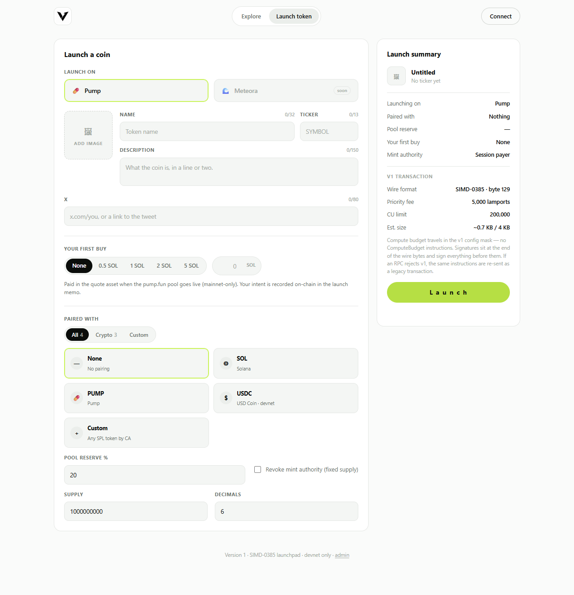

# Version 1 — SIMD-0385 Token Launchpad

A pump.fun-style token launchpad for Solana devnet whose entire transaction
pipeline is a from-scratch implementation of
**[SIMD-0385: Transaction V1 Format](https://github.com/solana-foundation/solana-improvement-documents/blob/main/proposals/0385-transaction-v1.md)** —
no `@solana/web3.js`, no SPL libraries, no bundler. Zero-build: plain HTML + JS.

Every launch builds real **v1 wire bytes** (version byte `129`), signs them, and
submits them to devnet — which already deserializes the format natively
(verified live). If an RPC ever rejects v1, the identical instructions are
re-encoded as a legacy transaction automatically.


## Run it

```
python -m http.server 8000    # then open http://localhost:8000
```

(or just open `index.html` — it works from `file://`.)

## The launchpad

**Explore** — hero stats, search + sort, and a coin-card grid: avatar,
`$TICKER` with a lime **v1** badge, supply, pairing chip, and a live activity
sparkline per coin pulled from devnet. Clicking a coin opens live on-chain
stats: supply / holders / transactions / mint-authority tiles, an activity
chart, and a top-holders distribution chart.

**Launch token** — image, name/ticker/description with counters, X link,
"your first buy" (recorded on-chain in the memo; pools are mainnet-only),
"paired with" picker (SOL, PUMP, devnet USDC, or **any custom CA**), pool
reserve %, revoke-mint-authority, and a live launch-summary sidebar with a
dedicated **v1 transaction** section (wire format, config-mask priority fee,
CU limit, size vs the 4096-byte cap).



**/admin** — operational console sharing state via localStorage: launch payer
(airdrop / import / export / rotate), RPC endpoint + v1 config, launches
management, the annotated byte dump + sanitizer report of the last built
transaction, and a live activity log.

### What launching does (one v1 transaction)

1. `CreateAccount` + `InitializeMint2` (payer holds authority temporarily so it can sign `MintTo` in-transaction)
2. `CreateAccount` + `InitializeAccount3` — owner's token account (owner = connected wallet)
3. `MintTo` — owner share of supply
4. *(if paired)* reserve token account + `MintTo` for the pool reserve
5. `SetAuthority` — mint authority handed to your wallet, or revoked
6. `Memo` — JSON: name, symbol, description, X link, image SHA-256, pairing (venue/quote/reserve), first-buy intent

Wallets can't sign SIMD-0385 bytes yet, so a throwaway session payer signs the
transaction and the connected wallet receives supply + mint authority
atomically in the same transaction.

## The SIMD-0385 implementation (`js/tx_v1.js`)

Encoder, decoder, and sanitizer for the full v1 wire layout: version byte 129 ·
legacy header · u32 config mask · 32-byte LifetimeSpecifier · fixed-width
instruction headers (u8, u8, u16 LE) · signatures **at the end**, each signing
all preceding bytes with the keypair of `Addresses[i]`.

Config-mask bits: **0+1** priority fee (total lamports, u64 LE across two
4-byte entries — must be set together) · **2** compute-unit limit · **3**
loaded-accounts-data-size limit · **4** heap size (multiple of 1 KiB in
[32 KiB, 256 KiB]). No ComputeBudget instructions — that's the point of the
format.

The sanitizer enforces every rule in the SIMD: 4096-byte cap, ≤12 signatures,
≤64 accounts/instructions, no trailing bytes, no duplicate addresses, header
invariants, index bounds, unknown mask bits, and ed25519 verification of each
signature.

## Verification

```
node test/node_test.js
```

18 checks: offline round-trip + tamper tests (corrupted signature, trailing
data, unknown mask bit, duplicate address, bad heap size, split fee bits), then
live devnet checks — the node **deserializes and signature-verifies the v1
bytes**; an unfunded payer fails with *"no record of a prior credit"*, which
only happens after format and signatures were accepted.

## Files

```
index.html          the launchpad (Explore + Launch token)
admin/index.html    operational console
assets/logo.png     the Version 1 mark
js/util.js          base58, LE encoders, hex, shortvec
js/rpc.js           raw JSON-RPC client with 429 backoff
js/instructions.js  hand-encoded System/Token/Memo/ComputeBudget ixs + account compiler
js/tx_v1.js         ★ SIMD-0385 encoder + decoder + sanitizer
js/tx_legacy.js     legacy wire format (fallback)
js/app.js           UI: explore grid, launch flow, charts, wallet connect
test/node_test.js   offline + live-devnet test suite
```

**Devnet only.** The session payer is a throwaway keypair in localStorage —
never fund it with real SOL. The public devnet RPC rate-limits aggressively;
set your own endpoint in `/admin` if stats show as unavailable.
